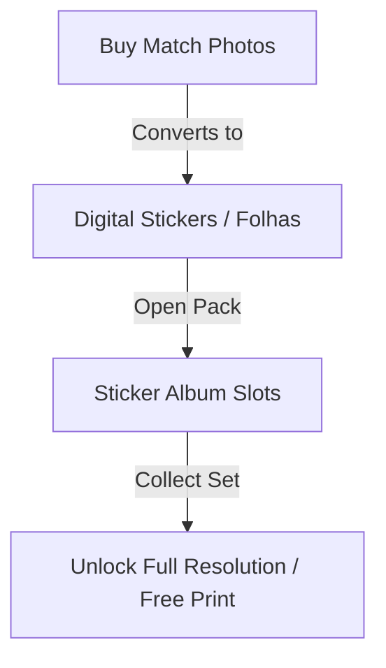

# 08. Gamification & Torcida Album - Foto Segundo

Breakdown of the loyalty loops, cashback features, and the gamified World Cup/Torcida Album digital sticker features.

## 🏆 Loyalty Loops & Virtual Credits

To maximize engagement and convert one-time event buyers into repeat customers, Foto Segundo implements several gamification systems:

### 1. Cashback Wallet (`rewardCredits`)

- Every purchase made on the platform grants **5% cashback** in the form of virtual platform credits.
- These credits are saved in the `User` schema (`rewardCredits` decimal field) and can be used as direct payment tokens during subsequent checkouts.
- All credits earned/spent are logged in the `GamificationLedger` for absolute auditability.

### 2. Profile Gamification Stepper

- Photographer profile completeness is gamified.
- Completing setup milestones (verifying phone, uploading profile picture, detailing gear) grants experience badges and raises their sorting priority in the public professionals catalog (`isExperienceValidated`).

---

## ⚽ The Torcida Album (Digital Sticker Album)

Designed specifically for sports events (e.g. school soccer leagues, amateur tournaments), the Torcida Album replicates the nostalgic feeling of physical sticker books.

### 1. Stickers & Packs (`worldCupFolhas`)

- Purchases of specific sports event packages grant the client packs of digital stickers containing photos from the match.
- Users open packs with high-fidelity, polished, fluid opening animations, revealing the "stickers" (photographs).
- These stickers are pasted into respective player/team slots inside the virtual album (`AlbumTorcidaPage`).

### 2. Validation & Exchange Loops

- Friends/parents can exchange duplicate stickers or request validation for specific player slots.
- Completing pages or full albums unlocks premium perks, such as complimentary physical photo prints via the Phygital Pipeline or free high-definition downloads.
